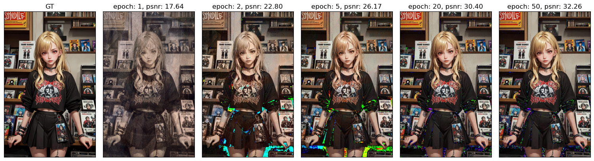

# dense-grid-image-reconstruction



**Problem:**
Reconstruct a set of images by learning method.

**Method:** Using multi-resolution dense grid data structure and neural networks. 

1. Contrusct a multi-resolutional dense grid as coordinate-based data structure to store corresponding features.
2. Location of each pixel is transformed into that coordinate system and the color value is determined by linearly interpolating features of correspdoning vertices of the cell it belongs to.
3. Training and testing data are generated by pixels of original images.
4. During reconstruction, can provide arbitary resolution.

**Details:** [notebook/demo.ipynb](notebook/demo.ipynb)

### Environment setup

- [Anaconda](https://www.anaconda.com/), for python package management.

```
    conda env create -f environment.yaml
    conda activate dgir
```