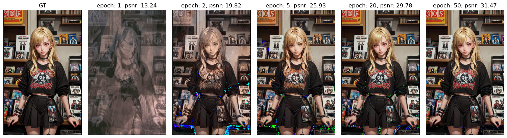

# dense-grid-image-reconstruction



**Problem:**
Learn and reconstruct a set of images as any resolution.

**Method:** Using multi-resolutional dense grid based bilinear resampling and neural networks. 

1. Contrusct a multi-resolutional dense grid as coordinate-based data structures to store learnable features.
2. Each pixel of image is transformed into that coordinate system (e.g. UV).
3. Color value is determined by bilinear interpolation of features stored in neighbor vertices.
4. Training and testing samples are generated from the pixels of original images.
5. Samples for reconstruction can be generated at any resolution.

**Details:** [notebook/demo.ipynb](notebook/demo.ipynb)

### Environment setup

- [Anaconda](https://www.anaconda.com/), for python package management.

```
    conda env create -f environment.yaml
    conda activate dgir
```